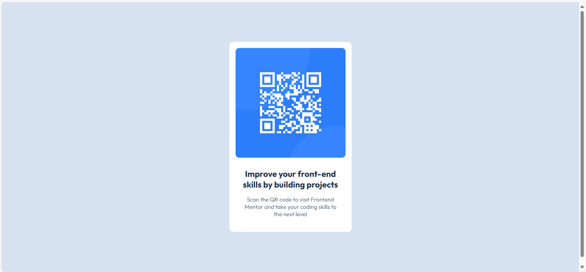

# Frontend Mentor - QR code component solution

This is a solution to the [QR code component challenge on Frontend Mentor](https://www.frontendmentor.io/challenges/qr-code-component-iux_sIO_H). 

## Overview

### Screenshot

### Links

- [Solution URL](https://github.com/Gehad28/Gehad28.github.io)
- [Live Site URL](https://gehad28.github.io)

### Built with

- Semantic HTML5 markup
- CSS custom properties

## Author

- Website - [Gehad Ahmad](https://github.com/Gehad28)
- Frontend Mentor - [@Gehad28](https://www.frontendmentor.io/profile/Gehad28)
